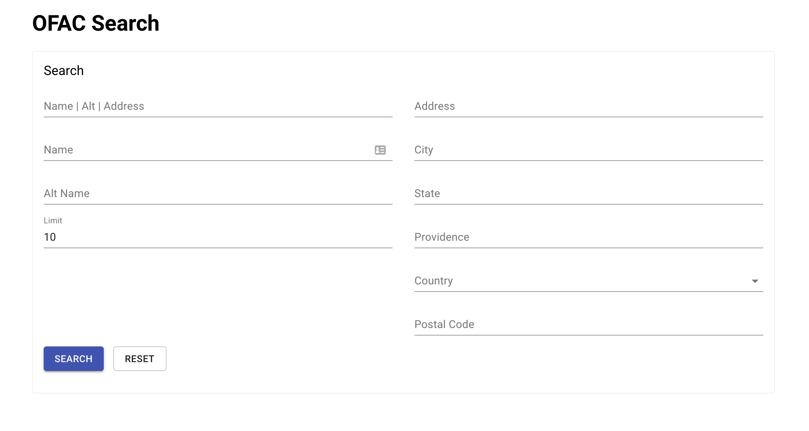

## v0.22.0 (Released 2022-07-21)

Watchman v0.22.0 has started to use Go 1.18 and its support for generic programming has helped us greatly clean up our code. We've also refreshed our [documentation website](https://moov-io.github.io/watchman/).

ADDITIONS

- cmd/server: add Military End User (MEU) results to search response
- cmd/server: add an optional webhook to be notified of data downloads
- cmd/server: read `WEBHOOK_MAX_WORKERS` to configure max webhook processors
- csl: support extracting Military End User (MEU) List
- feat: allow overrides to jaro-winkler parameters

IMPROVEMENTS

- cmd/server: dig into CSL entity types to precompute AlternateNames
- cmd/server: generic function for CSL entity precompute step
- docs: show sdnType examples in query params

BUILD

- build: update to Fedora 37 for OpenShift, node and react
- build: update to Go 1.18, Node 16 and Debian versions
- cmd/server: cleanup t.Error calls for better visibility
- cmd/server: switch to an outside mysql container, remove dockertest
- examples/webhook: update docker image to Go 1.18

## v0.21.5 (Released 2022-04-04)

BUILD

- build(deps): bump lodash from 4.17.19 to 4.17.21 in /webui
- build(deps): bump minimist from 1.2.5 to 1.2.6 in /webui
- fix(deps): update module github.com/moov-io/base to v0.28.1
- fix(deps): update react monorepo to v18

## v0.21.4 (Released 2022-03-04)

IMPROVEMENTS

- all: update logging to moov-io/base using better structures and key/value pairs

BUILD

- Improve code coverage and fix errors form gosec
- Upgrade to Go 1.17
- Upgrade github.com/go-kit/kit to v0.12.0
- Upgrade github.com/mattn/go-sqlite3 to v1.14.11
- Upgrade github.com/moov-io/base to v0.27.5
- Upgrade github.com/ory/dockertest/v3 to v3.8.1
- Upgrade github.com/pariz/gountries to v0.1.5
- Upgrade github.com/prometheus/client_golang to v1.12.1

## v0.21.3 (Released 2021-11-10)

IMPROVEMENTS

- fix: skip malformed rows in input files (#379)

## v0.21.2 (Released 2021-11-09)

IMPROVEMENTS

- build: enable gosec and coverage linter
- fix: DPL records could have invalid characters, add length guards
- fix: ignore misspell checks on valid test data
- fix: ofac SDN comments file has invalid characters / column counts

## v0.21.1 (Released 2021-10-04)

Release v0.21.1 applies bugfix to pre-computation steps to SDN alternate names.

BUG FIXES

- search: bugfix for pipeline steps to SDN alt names (#376)

## v0.21.0 (Released 2021-09-29)

Release v0.21.0 applies pre-computation steps to SDN alternate names which was previously missing. This impacts
match performance for only those results.

BUG FIXES

- search: apply pipline steps to SDN alt names (#375)

## v0.20.0 (Released 2021-08-27)

Watchman v0.20.0 improves scoring by reducing false positives. There are two changes implemented in this
release to achive better scoring. First is to keep a more accurate list of scores for our query, which means
longer queries will return more accurate results than before. Second is that we will always score at least two
words, which helps to reduce false positives from "first last" queries.

IMPROVEMENTS

- docs/intro: mention jaro-winkler is used and why
- search: properly keep top N word scores, match at least two words

BUG FIXES

- ofac: skip error with shared initial directory

BUILD

- build: use debian stable's slim image
- fix: Dockerfile to reduce vulnerabilities
- meta: fixup from gosec linters

## v0.19.2 (Released 2021-07-21)

IMPROVEMENTS

- cmd/server: add `match` score to OpenAPI search entities
- cmd/server: document CSL separation in struct

BUILD

- chore(deps): update dependency @material-ui/core to v4.12.2

## v0.19.1 (Released 2021-07-16)

BUG FIXES

- cmd/server: nil check on setting updated records
- download: fixup reading of initial dir rather than downloading
- dpl: find file rather than assume its index

IMPROVEMENTS

- cmd/server: misc improvements from linters

BUILD

- build(deps): bump addressable from 2.7.0 to 2.8.0 in /docs
- chore(deps): update dependency @material-ui/core to v4.12.1
- cmd/server: add benchmark for ?minMatch=0.50
- cmd/server: add benchmarks for various SDN search queries
- fix(deps): update react monorepo to v17
- fix: Dockerfile to reduce vulnerabilities
- fix: upgrade react-scripts from 4.0.1 to 4.0.3
- test: add static set of files for benchmarks

## v0.19.0 (Released 2021-06-10)

This release improves search results by filtering as part of scoring instead of after the fact.
Users should see more results returned for queries now.

ADDITIONS

- cmd/server: add `?minMatch=0.95` query param for searching

IMPROVEMENTS

- cmd/server: remove unneeded X-User-ID HTTP headers
- cmd/server: filter as part of searching, not after the fact

BUILD

- build: split CI into multiple jobs for parallel runs

## v0.18.2 (Released 2021-06-01)

BUG FIXES

- cmd/server: nil check on webhook response body prior to Close

BUILD

- build(deps): bump nokogiri from 1.11.1 to 1.11.5 in /docs

## v0.18.1 (Released 2021-05-20)

BUG FIXES

- csl: don't panic if list comes back invalid

BUILD

- build(deps): bump rexml from 3.2.4 to 3.2.5 in /docs
- chore(deps): update dependency @material-ui/core to v4.11.4

## v0.18.0 (Released 2021-04-29)

IMPROVEMENTS

- cmd/server: concurrently search instead of serial iterations

BUILD

- build: upgrade github.com/gogo/protobuf to v1.3.2

## v0.17.1 (Released 2021-02-23)

IMPROVEMENTS

- chore(deps): update golang docker tag to v1.16

## v0.17.0 (Released 2021-02-05)

ADDITIONS

- search: introduce `EXACT_MATCH_FAVORITISM` config to optionally boost match rates

IMPROVEMENTS

- docs: lots of fixups and clarifications

BUG FIXES

- csl: fix parsing with newer CSV format

## v0.16.2 (Released 2021-02-02)

BUILD

- fix: upgrade react-scripts from 4.0.0 to 4.0.1

## v0.16.0 (Released 2021-01-22)

ADDITIONS

- api,client: add SdnType and SsiType models
- docs: include a page for prometheus metrics
- server: Add `last_data_refresh_failure{source="SDNs"}` Prometheus metric

BUG FIXES

- build: fixup OpenShift image, rely on glibc

BUILD

- chore(deps): update mui monorepo to v4.11.2
- fix(deps): pin dependency react-scripts to 4.0.0

## v0.15.3 (Released 2020-10-28)

BUG FIXES

- search: filter countries rather than rank
   - Previously we would only include the top N (`?limit` query param) results by country which could exclude valid search results from the final returend list. Now we filter the list and rank according to all data records matching the specified country.
- search: OR NameAndAddress results
   - Previous we would use AND semantics for returning "name and address" results even though they populated two different JSON arrays. Now we return the highest N `SDNs` and `Addresses` when both query params are specified.

## v0.15.2 (Released 2020-10-28)

BUG FIXES

- webui: fix Country "All" value so it's not passed through to query params

IMPROVEMENTS

- batchsearch: include final success message
- webui: fix warnings after react upgrade
- webui: include a links section in the header

BUILD

- fix(deps): update react monorepo to v16.14.0
- webui: run "npm audit fix"

## v0.15.1 (Released 2020-10-05)

BUG FIXES

- pkg/ofac: skip sdn_comments.csv lines if they contain the incorrect number of fields

IMPROVEMENTS

- docs/search: include supported combinations of query params

BUILD

- admin,client: update codegen, reference base Error model

## v0.15.0 (Released 2020-09-09)

BREAKING CHANGES

Watchman has upgraded the implementation of the Jaro-Winkler string comparison algorithm to fix bugs and match the original paper's reference implementation. After upgrading Watchman you will notice higher match percentages for most comparisons. See [pull request #282](https://github.com/moov-io/watchman/pull/282) for the change.

BUG FIXES

- search: skip calling webhooks if we don't render a body
- search: test body creation in async methods

BUILD

- chore(deps): update golang docker tag to v1.15
- docs: re-order "getting started" to suggest docker image

## v0.14.3 (Released 2020-09-01)

BUG FIXES

- csl: fix reader to handle files with unique IDs
- search: reference appropriate SDN for webhook body
- webhooks: handle nil Response without a panic

BUILD

- webui: run 'npm audit fix'

## v0.14.2 (Released 2020-07-08)

BUILD

- build: add OpenShift docker image
- build: upgrade golang.org/x/text to v0.3.3
- chore(deps): update dependency @material-ui/core to v4.11.0

## v0.14.0 (Released 2020-04-14)

ADDITIONS

- build: add moov/watchman:static image for better test instances
- cmd/server: add version handler to admin HTTP server
- cmd/server: record download counts per entity type in `last_data_refresh_count` Prometheus metric

IMPROVEMENTS

- admin,client: fix package names, upgrade openapi-generator to 4.2.3
- all: misc test cleanup from staticcheck
- api,client: use shared Error model
- api,client: use shorter API summaries
- build: run sonatype-nexus-community/nancy in CI
- build: setup windows CI and releases
- download: set custom User-Agent header
- pkg/csl: use endpoint to download which doesn't require an api key

BUG FIXES

- ofac: allow unescaped inner quotes in SDN comments records

BUILD

- build: upgrade to Go 1.14.x
- build: upgrade staticcheck to 2020.1.3
- build: don't 'make docker' twice
- build: update Copyright headers for 2020
- build: upgrade mysql client to 1.5
- build: don't wipe both generated dirs on 'make clean'
- chore(deps): update dependency @material-ui/core to v4.9.9
- chore(deps): update golang docker tag to v1.14
- chore(deps): update module moov-io/base to v0.11.0
- chore(deps): update module prometheus/client_golang to v1.4.0
- chore(deps): update mui monorepo to v4.9.1

## v0.13.2 (Released 2020-03-03)

IMPROVEMENTS

- ofac: allow unescaped inner quotes in SDN comments records
- ofac: add filename and more logging context for debugging refresh errors

## v0.13.1 (Released 2020-01-28)

IMPROVEMENTS

- pkg/csl: use endpoint to download which doesn't require an api key

## v0.13.0 (Released 2019-12-20)

This project has been renamed to Moov Watchman (from Moov OFAC) to better represent coverage of multiple entity lists covering trade sanctions and regional compliance laws.

The OpenAPI specification models have been renamed to include an `Ofac` prefix on their name and OFAC HTTP routes have an `/ofac/` prefix.

BREAKING CHANGES

- pkg/ofac: `SDN.Program string` has been renamed to `SDN.Programs []string` and is populated with all programs an SDN was created from.

ADDITIONS

- cmd/server: Add Sectoral Sanctions Identifications List via Consolidated Screening List (CSL)
- cmd/server: Add Bureau of Industry and Security Entity List via Consolidated Screening List
- cmd/server: Remove stopwords from OFAC SDN entity names, DP's, SSI, and BIS Entities
- cmd/server: Remove company suffixes in indexed names (such as LLC, Co., LTDA.)
- cmd/server: add admin route to debug indexed SDN information
  - Example: `curl http://localhost:9094/debug/sdn/16016`

IMPROVEMENTS

- cmd/server: concurrently search ?q=foo
- cmd/server: add KEEP_STOPWORDS env config
- pkg/ofac: clean up SDN programs when reading csv
- cmd/server: handle an SDN's program list as an array in search, fixup UI values endpoint
- cmd/server: add TopAltNames to searchByName
- cmd/server: clarify shutdown logging
- cmd/server: pipeline: trim spaces, split hyphenated words

BUG FIXES

- pkg/dpl: ignore first line of header information
- cmd/server: match remark ID's exactly in all cases

BUILD

- fix(deps): update react monorepo to v16.12.0
- chore(deps): update dependency @material-ui/core to v4.8.0
- build: upgrade openapi-generator to 4.2.2
- fix(deps): update dependency react-scripts to v3.3.0

## v0.12.0 (Released 2019-11-12)

BREAKING CHANGES

- `Address` in our OpenAPI spec and generated Go client was renamed `EntiyAddress` to provide a more specific naming when combined in Moov's larger OpenAPI specification.

ADDITIONS

- cmd/server: add histogram for match percentages
- cmd/ofaccheck: initial setup of a cli tool for batch searches
- cmd/server: AND name and address queries if params are provided

BUILD

- build: upgrade Go and webui dependencies

## v0.11.0 (Released 2019-10-08)

This release adds a web interface for OFAC (developed by [Linden Lab](https://www.lindenlab.com/)) which allows for easier querying from desktop and mobile browsers. Also added are query params to apply additional filtering (exmaple: `sdnType=individual`) and we have improved match percentages to closer mirror the [official OFAC search tool](https://sanctionssearch.ofac.treas.gov/).

ADDITIONS

- cmd/server: add the web interface developed by Linden Lab
- cmd/server: accept additional query params to filter SDN search results
  - `?sdnType=individual` and `?program=example`
- cmd/server: add endpoint for applications to grab distinct sets of column values
  - `GET /ui/values/sdnType` returns `["aircraft","individual","vessel"]`
- cmd/server: add `/search?id=NNN` endpoint for matching remark IDs
- cmd/server: return the oldest refresh time for our data in search results
- cmd/server: add `-base-path` for serving HTTP routes and web UI from non-root paths

IMPROVEMENTS

- api,client: specify x-request-id and x-user-id as optional HTTP headers
- cmd/ofactest: set x-request-id and x-user-id HTTP headers if CLI flags are set
- cmd/server: use a non-nil logger in search HTTP route tests
- cmd/server: adjust jaro weighting to maximize total weight in strong single word matches

BUG FIXES

- cmd/server: fix spelling of jaroWinkler
- cmd/server: never allow jaroWinkler to return NaN
- cmd/server: match treasury.gov match percentages

BUILD

- cmd/server: update github.com/moov-io/base to v0.10.0
- build: download CI tools rather than install
- build: remove mysql setup from docker-compose.yml

## v0.10.0 (Released 2019-08-16)

This release contains improvements to OFAC's match percentages to tone down false positives. We do this by adjusting the match percentage according to the query and SDN lenth ratio -- if the two strings are different lengths (after normalization) they cannot be equal. We are looking for feedback to further improve the matching code.

BREAKING CHANGES

- api,client: We've renamed all fields like `*Id` to `*ID` which is consistent with Go's style.

BUG FIXES

- attempt retries when downloading files
- download: return after successful download
- cmd/server: search: fix match percents after jaroWinkler change
- cmd/server: when reordering names handle multiple first or last names

ADDITIONS

- internal/database: log which provider we're using
- cmd/server: bind HTTP server with TLS if HTTPS_* variables are defined
- cmd/server: disable perioidic refresh via OFAC_DATA_REFRESH=off
- download: check for initial files on first refresh

IMPROVEMENTS

- build: upgrade openapi-generator to 4.1.0
- all: skip more tests on -short

## v0.9.0 (Released 2019-07-18)

BREAKING CHANGES

- The admin endpoint `:9092/ofac/refresh` was renamed to `:9092/data/refresh`

ADDITIONS

- cmd/server: Include the BIS Denied Person's List data in search endpoints
- cmd/server: Support MySQL as a storage layer via `DATABASE_TYPE=mysql` (See: [#100](https://github.com/moov-io/ofac/pull/100))

IMPROVEMENTS

- build: push moov/ofac:latest on 'make release-push'
- docs: update docs.moov.io links after design refresh
- build: update dependencies
- cmd/server: rename manual refresh endpoint to /data/refresh

## v0.8.0 (Released 2019-06-19)

BREAKING CHANGES

- api: Rename 'searchSDNs' to 'search' to reflect capability of other search capabilities
- api: Add `*OFAC*` on Company and Customer OpenAPI operations (and thus generated clients)

ADDITIONS

- api: Added Company routes and generated client code
- cmd/server: async: send webhooks on company/customer name watches (with match %)
- docs: add "A Framework for OFAC Compliance Commitments" from the US Treasury
- cmd/server: search: handle ?country and average weight with ?address
- cmd/server: handle city, state, providence, and zip in address search

BUG FIXES

- cmd/server: return database/sql Rows.Err
- api: add missing 'notes' field on UpdateCompanyStatus and UpdateCustomerStatus
- docs: describe moov's primary usage of OFAC (for paygate)

## v0.7.0 (Released 2019-04-25)

ADDITIONS

- cmd/server: support GET /search?q=... for searching SDN names, alt names, and address field

IMPROVEMENTS

- cmd/server: set CORS headers in ping route
- cmd/server: UTF-8 normalize names during pre-computation
- cmd/server: re-order SDN names where surname precedes "first name"
- cmd/server: support -log.format=json

BUG FIXES

- cmd/server: add missing database/sql Rows.Close()

BUILD

- Update to Go 1.12

## v0.6.0 (Released 2019-02-26)

IMPROVEMENTS

- Setup automated releases of binaries and Docker image

## v0.5.2 (Released 2019-02-21)

ADDITIONS

- Added `moov/ofactest` docker image

## v0.5.1 (Released 2019-02-21)

BUG FIXES

- `cmd/ofactest`, `client`: fix Watch create JSON and cleanup ofactest watches

## v0.5.0 (Released 2019-02-15)

ADDITIONS

- Add Company routes, persistence, client code, and watches
- `cmd/ofactest`: add -local and -webhook flags
- `cmd/ofactest`: read optional search query parameter

IMPROVEMENTS

- Ignore whitespace in string similarity
- `example`: Read Company or Customer JSON from webhook

BUG FIXES

- Fix capitalization of various JSON properties

## v0.4.0 (Released 2019-02-12)

ADDITIONS

- Added `"match": 0.91` as a percent of SDN name match to parameter.
- Support setting a customer to `unsafe` or `exception` status.

## v0.3.0 (Released 2019-02-07)

CHANGES

- Require `authToken` when creating a Watch (webhook notification)

ADDITIONS

- Added `last_ofac_data_refresh_success` Prometheus metric
- `cmd/ofactest`: for testing OFAC HTTP endpoints

## v0.2.1 (Released 2019-02-04)

IMPROVEMENTS

- Stop expecting `X-User-Id` header to be present (and non-empty)

## v0.2.0 (Released 2019-02-04)

IMPROVEMENTS

- Implement fuzzy search with Levenshtein for word to word comparisons
- Periodically refresh data (according to `OFAC_DATA_REFRESH`, default: `12h`)
- Write OpenAPI v3 specification and generate a Go client
- SQLite persistence for downloads, watches, and webhook results
- Add `GET /downloads?limit=N` for latest N data download metadata

BUG FIXES

- Remove OFAC null characters (`-0-`) from data (and HTTP api)

## v0.1.0 (Released 2019-01-18)

- Initial release
