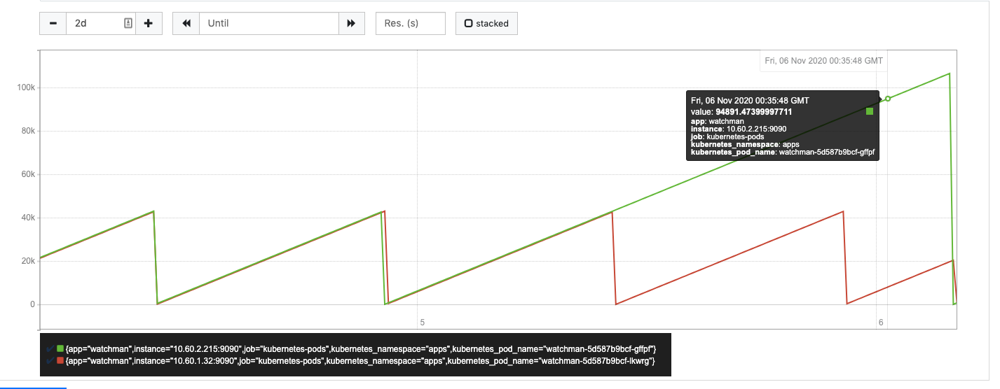
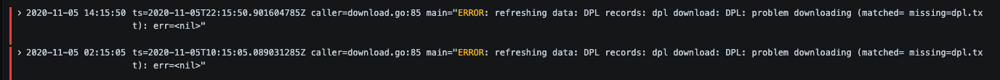

# Runbook

## Change Data refresh frequency

`DATA_REFRESH_INTERVAL=1h0m0s` can be set to refresh data more or less often. The value should match Go's `time.ParseDuration` syntax.

## Force data refresh

Make a request to `/data/refresh` on the **admin** HTTP interface (`:9094` by default).

```
$ curl http://localhost:9094/data/refresh
{"SDNs":7724,"altNames":10107,"addresses":12145,"deniedPersons":548}
```

## Change OFAC download URL

By default, OFAC downloads [various files from treasury.gov](https://www.treasury.gov/resource-center/sanctions/SDN-List/Pages/default.aspx) on startup and will periodically download them to keep the data updated.

This URL can be changed and follows a template as several files are downloaded (example: `add.csv` or `sdn.csv`). To change where OFAC files are downloaded, set:

`OFAC_DOWNLOAD_TEMPLATE='https://www.treasury.gov/ofac/downloads/%s'`

You should make the following files available at the new endpoint: `add.csv`, `alt.csv`, `sdn.csv`, `sdn_comments.csv`.

## Change DPL download URL

By default, Denied Person's List (DPL) downloads [from the BIS website](https://bis.data.commerce.gov/dataset/Denied-Persons-List-with-Denied-US-Export-Privileg/xwtd-wd7a/data) on startup and will periodically re-download to keep data fresh.

The URL can be changed, but must end with `dpl.txt` in the final URL path segment.

`DPL_DOWNLOAD_TEMPLATE=https://www.bis.doc.gov/dpl/%s`

## Use local directory for initial data

You can specify the `INITIAL_DATA_DIRECTORY=test/testdata/` environmental variable for Watchman to initially load data from a local filesystem. The data will be refreshed normally, but not downloaded on startup.

## Change SQLite storage location

To change where the SQLite database is stored on disk, set `SQLITE_DB_PATH` as an environmental variable.

## Webhook batch processing size

The size of each batch of watches to be processed (and their webhook called) can be adjusted with `WEBHOOK_BATCH_SIZE=100`. This is intended for performance improvements by using a larger batch size.

## Alert on stale data

Watchman [reports several Prometheus metrics](./metrics.md) that can be scraped. Operators should be familar with them to monitor and support Watchman.

We have an [example Prometheus alert](https://github.com/moov-io/infra/blob/eb0072393756e4b9d8d67eda98db0fab0b05f00b/lib/infra/14-prometheus-rules.yml#L57-L65) for being notified of stale data. This helps discover issues in case download or parsing fails.



The above metrics are from an instance where a `StaleWatmanData` was fired. It was due to two download attempts failing which let the `last_data_refresh_success` lapse past 24 hours.



You can resolve this issue by [manually refreshing the sanction lists](https://moov-io.github.io/watchman/admin/#post-/data/refresh) with Watchman's admin endpoint.
