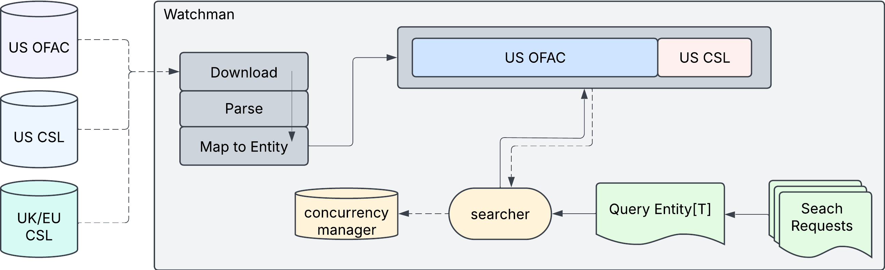

# Watchman Search Guide

> For documentation on older releases of Watchman (v0.31.x series), please visit the [older docs website](https://github.com/moov-io/watchman/tree/v0.31.3/docs) in our GitHub repository.

## Overview



## Search Endpoint

Watchman provides multiple search endpoints and parameters to help you find the exact matches you need. Different search options access different combinations of watchlists.

```
GET /v2/search?type=person&name=nicolas+maduro&limit=1
```

### Senzing Formatting

Set the `Accept` header or `format` query parameter to receive responses in [senzing format](https://www.senzing.com/docs/entity_specification/). To receive responses as JSON Lines specify the subformat as seen below.

```
Accept: senzing       # Array of objects [{...}, {...}]

Accept: senzing/jsonl # One object per line {...}\n{...}
```

The `format` query parameter accepts this as well, `?format=senzing` or `?format=senzing/jsonl`.

### Entity Types

The API requires specifying an entity type:

| Type | Description | Example Query |
|------|-------------|---------------|
| `person` | Individual persons | `?type=person&name=nicolas maduro` |
| `business` | Business entities | `?type=business&name=tidewater` |
| `organization` | Non-business organizations | `?type=organization&name=hamas` |
| `aircraft` | Aircraft registrations | `?type=aircraft&callSign=EP-GOM` |
| `vessel` | Maritime vessels | `?type=vessel&imoNumber=9401598` |

### Advanced Entity Search Parameters

Each entity type supports specific search parameters:

#### Person Parameters
- `name`: Primary name
- `altNames[]`: Alternative names
- `gender`: Gender (male/female/unknown)
- `birthDate`: Date of birth (YYYY-MM-DD)
- `deathDate`: Date of death (YYYY-MM-DD)
- `titles[]`: Professional titles

#### Business/Organization Parameters
- `name`: Entity name
- `altNames[]`: Alternative names
- `created`: Formation date (YYYY-MM-DD)
- `dissolved`: Dissolution date (YYYY-MM-DD)

#### Aircraft Parameters
- `name`: Aircraft name/identifier
- `altNames[]`: Alternative designations
- `aircraftType`: Type of aircraft
- `flag`: Country of registration
- `built`: Build date (YYYY-MM-DD)
- `icaoCode`: ICAO code
- `model`: Aircraft model
- `serialNumber`: Serial number

#### Vessel Parameters
- `name`: Vessel name
- `altNames[]`: Alternative names
- `imoNumber`: IMO number
- `vesselType`: Type of vessel
- `flag`: Flag country
- `built`: Build date (YYYY-MM-DD)
- `mmsi`: MMSI identifier
- `callSign`: Radio call sign
- `tonnage`: Vessel tonnage
- `grossRegisteredTonnage`: GRT measurement
- `owner`: Vessel owner

#### Common Parameters for All Entity Types
- `address[]`: Physical addresses
- `email[]`, `emailAddress[]`, `emailAddresses[]`: Email addresses
- `phone[]`, `phoneNumber[]`, `phoneNumbers[]`: Phone numbers
- `fax[]`, `faxNumber[]`, `faxNumbers[]`: Fax numbers
- `website[]`, `websites[]`: Associated websites
- `cryptoAddress[]`: Cryptocurrency addresses (format: `currency:address`)

### Search Response

The API returns a unified structure with match scores and entity details:

```json
{
  "entities": [
    {
      "entity": {
        "name": "MADURO MOROS, Nicolas",
        "entityType": "person",
        "sourceList": "us_ofac",
        "sourceID": "22790",
        "person": {
          "name": "Nicolas MADURO MOROS",
          "gender": "male",
          "birthDate": "1962-11-23T00:00:00Z"
        },
        "addresses": [
          {
            "city": "Caracas",
            "country": "VE"
          }
        ]
      },
      "match": 0.9444444444444444
    }
  ]
}
```

## Name Search

The name search targets primary entity names across key watchlists:

```
GET /search?name=maduro&limit=2
```

**Use this when**: You're specifically looking for matches against primary entity names.

## Alternate Name Search

Many sanctioned entities operate under aliases or alternate names. This search targets those specifically:

```
GET /search?altNames=NATIONAL+BANK+OF+CUBA
```

**Use this when**: You're looking for entities that might be using known aliases.

## Address Search

Address search helps identify entities associated with specific locations:

```
GET /search?address=first+st&province=harare&country=zimbabwe
```

Available address parameters:
- `address`: Street address or general location
- `city`: City name
- `state`: State or region
- `province`: Province name
- `zip`: Postal or ZIP code
- `country`: Country name

## Filtering Results

Filtering is built into the entity model:

```
GET /v2/search?type=person&name=maduro&minMatch=0.8
```

Parameters:
- `minMatch`: Minimum match score (0.0-1.0) to include in results
- `limit`: Maximum number of results to return (default: 10, max: 100)
- `debug`: Include detailed scoring information when set to "true"


## Cross-Script Name Matching

Watchman supports searching for names written in non-Latin scripts (Arabic, Cyrillic, Chinese, etc.) against Latin names in sanctions lists using neural network embeddings.

```bash
# Arabic query finds "Mohamed Ali" in OFAC list
curl -X POST http://localhost:8084/v2/search \
  -H "Content-Type: application/json" \
  -d '{"name": "محمد علي", "type": "person"}'
```

| Script | Example Query | Matches | Score |
|--------|---------------|---------|-------|
| Arabic | محمد علي | Mohamed Ali | 97% |
| Cyrillic | Владимир Путин | Vladimir Putin | 99.8% |
| Chinese | 金正恩 | Kim Jong Un | 79% |

This feature requires:
1. Building with `-tags embeddings`
2. Running an embeddings provider (Ollama, OpenAI, etc.)
3. Enabling via `EMBEDDINGS_ENABLED=true`

For detailed setup instructions, see [Cross-Script Name Matching](cross-script-matching.md).

## Best Practices

1. **Use specific IDs when available**
   - ID-based searches provide the highest confidence matches
   - Example: government IDs, IMO numbers, passport numbers

2. **Combine multiple parameters**
   - Searching with name + address improves match quality
   - Example: `?type=person&name=maduro&address=caracas&country=VE`

3. **Adjust match thresholds**
   - Set `minMatch` parameter for filtering low-confidence matches
   - Configure match favoritism based on your risk tolerance

5. **Include contextual information**
   - Add dates, addresses, and identifiers when available
   - Reduces false positives and improves match confidence

## API Documentation

For complete API details, refer to the [API Documentation](https://moov-io.github.io/watchman/api/).
