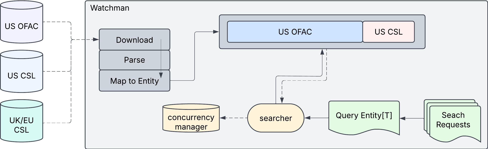

# Watchman Search Guide

All screening goes through **`/v2/search`**. Send a type, a name, and any IDs, dates, or addresses you have. Watchman returns ranked hits with a score from 0 to 1.

Practical recipe: [Using Watchman](/watchman/using-watchman/).

## Overview



## Search Endpoint

Screening is **`GET /v2/search`**. There is no JSON POST body on this path.

```
GET /v2/search?type=person&name=Dmitry+Khoroshev&gov_passport=RU:2018278055&minMatch=0.80&limit=1
```

Wait until `GET /v2/listinfo` shows `us_ofac` (or your lists) before the first search. A matching passport scores **1.0**; the same name without an ID is below 0.80.

### Senzing Formatting

Set the `Accept` header or `format` query parameter to receive responses in [senzing format](https://www.senzing.com/docs/entity_specification/). To receive responses as JSON Lines specify the subformat as seen below.

```
Accept: senzing       # Array of objects [{...}, {...}]

Accept: senzing/jsonl # One object per line {...}\n{...}
```

The `format` query parameter accepts this as well, `?format=senzing` or `?format=senzing/jsonl`.

### Matching Algorithm

Name scoring defaults to Watchman's Jaro-Winkler setup. Pass `algorithm` to select a string-matching algorithm per request:

| Value | Behavior |
|-------|----------|
| `jaro-winkler` (default) | Token pairwise Jaro-Winkler scoring |
| `soundex` | Jaro-Winkler with a Soundex phonetic boost for token pairs that encode to the same code (e.g. "Smith" / "Smythe") |
| `soft-bidist` | [Soft-Bidist](https://github.com/PhonoGrams/soft_bigram) character-bigram edit distance (Hadwan 2021). Aliases: `soft-bigram`, `bidist` |
| `soft-bisim` | [Soft-Bisim](https://github.com/PhonoGrams/soft-bisim) character-bigram similarity (Millán-Hernández 2019). Alias: `bisim` |
| `editex` | [Editex](https://github.com/PhonoGrams/editex) phonetic-group edit distance (Zobel & Dart 1996) |
| `nsim` | [Kondrak N-SIM](https://github.com/PhonoGrams/ngram) n=2 (BI-SIM). Aliases: `n-sim`, `kondrak` |
| `nsim-3` | Kondrak N-SIM n=3 (Trigram-2B affixing). Alias: `trigram` |
| `double-metaphone` | Jaro-Winkler with a [Double Metaphone](https://github.com/PhonoGrams/double_metaphone) boost when codes overlap |
| `beider-morse` | Jaro-Winkler with a [Beider-Morse](https://github.com/PhonoGrams/beider_morse) boost when generic keys overlap. Alias: `bmpm` |

```
GET /v2/search?type=person&name=smythe&algorithm=soundex
GET /v2/search?type=person&name=aleksandr&algorithm=soft-bidist
```

Inner scorers (`soft-bidist`, `soft-bisim`, `editex`, `nsim`, `nsim-3`) replace only the token pair metric. Phonetic options (`soundex`, `double-metaphone`, `beider-morse`) keep Jaro-Winkler and boost pairs whose encodings match. BestPairs alignment, length-difference penalty, and first-letter phonetic filter still apply. Jaro-Winkler remains the default.

See [Algorithm comparison](/watchman/algorithm-comparison/) for a generated score matrix (TF-IDF on/off) on paper and OFAC-style pairs.

When `algorithm` is omitted, process-wide flags such as `USE_SOUNDEX_MATCHING` still apply. An explicit `algorithm` value overrides those flags for that request. See [Similarity Configuration](/watchman/config/#similarity-configuration).

### Entity Types

`type` is **not required**. Send it anyway.

| Type | Description | Example Query |
|------|-------------|---------------|
| `person` | Individual persons | `?type=person&name=Dmitry+Khoroshev&gov_passport=RU:2018278055&minMatch=0.80` |
| `business` | Business entities | `?type=business&name=tidewater` |
| `organization` | Non-business organizations | `?type=organization&name=hamas` |
| `aircraft` | Aircraft registrations | `?type=aircraft&callSign=EP-GOM` |
| `vessel` | Maritime vessels | `?type=vessel&imoNumber=9401598` |

What the code does:

- **Omitted `type`** — searches the all-types partition for that source. Slower. Name, address, email, phone, and crypto still apply. Person/business/vessel fields (`birthDate`, `gov_*`, `imoNumber`, `altNames`, …) are **not** read; sending them without `type` is HTTP 400 (unused query parameter).
- **Correct `type`** — searches that source×type partition only. This is the production path.
- **Wrong `type`** (`type=business` for a person) — searches only that partition. The designated party is missing from the page. Watchman does not fall back to other types.

Person, business, and organization records can still be compared to each other *during scoring* when both sides are already candidates. A person query is not scored against a vessel or aircraft. An empty type partition (for example `type=aircraft` on a list with no aircraft) returns no matches.

See [Performance](/watchman/performance/), [Indexing](/watchman/indexing/), and [Record linkage](/watchman/record-linkage/).

When a **passport, national ID, IMO, MMSI, aircraft serial, or crypto address** matches on identifier and country, the score is **1.0**. A matching tax number, company registration, email, or phone raises the score; it does not force 1.0.

### Advanced Entity Search Parameters

Each entity type supports specific search parameters:

#### Person Parameters
- `name`: Primary name
- `altNames[]`: Alternative names
- `gender`: Gender (male/female/unknown)
- `birthDate`: Date of birth (`YYYY-MM-DD`, `YYYY-MM`, or `YYYY`)
- `deathDate`: Date of death
- `titles[]`: Professional titles
- `gov_<type>`: Government IDs as `COUNTRY:IDENTIFIER` (e.g. `gov_passport=IR:Y53914915`, `gov_national=US:1234`, `gov_tax=RU:9709063550`)

#### Business/Organization Parameters
- `name`: Entity name
- `altNames[]`: Alternative names
- `created`: Formation date (`YYYY-MM-DD`, `YYYY-MM`, or `YYYY`)
- `dissolved`: Dissolution date
- `gov_<type>`: Registration / tax IDs as `COUNTRY:IDENTIFIER` (evidence, not a 1.0 identity key)

#### Aircraft Parameters
- `name`: Aircraft name/identifier
- `altNames[]`: Alternative designations
- `aircraftType`: Type of aircraft
- `flag`: Country of registration
- `built`: Build date (YYYY-MM-DD)
- `icaoCode`: ICAO code
- `model`: Aircraft model
- `serialNumber`: Serial number

#### Vessel Parameters
- `name`: Vessel name
- `altNames[]`: Alternative names
- `imoNumber`: IMO number
- `vesselType`: Type of vessel
- `flag`: Flag country
- `built`: Build date (YYYY-MM-DD)
- `mmsi`: MMSI identifier
- `callSign`: Radio call sign
- `tonnage`: Vessel tonnage
- `grossRegisteredTonnage`: GRT measurement
- `owner`: Vessel owner

#### Common Parameters for All Entity Types
- `source`: Restrict to one list (`us_ofac`, `eu_csl`, `uk_csl`, `un_csl`, `us_csl`, …)
- `sourceID`: Exact record id on that list (OFAC entity ID, etc.)
- `address[]`: Physical addresses
- `email[]`, `emailAddress[]`, `emailAddresses[]`: Email addresses
- `phone[]`, `phoneNumber[]`, `phoneNumbers[]`: Phone numbers
- `fax[]`, `faxNumber[]`, `faxNumbers[]`: Fax numbers
- `website[]`, `websites[]`: Associated websites
- `cryptoAddress[]`: Cryptocurrency addresses (`currency:address`)

### Search Response

The API returns the original query plus matched entities. Each element of `entities` **is** the list record, with `match` (0.0–1.0) on the same object:

```json
{
  "query": {
    "name": "Dmitry Khoroshev",
    "entityType": "person"
  },
  "entities": [
    {
      "name": "Dmitry Yuryevich KHOROSHEV",
      "entityType": "person",
      "sourceList": "us_ofac",
      "sourceID": "48603",
      "person": {
        "name": "Dmitry Yuryevich KHOROSHEV",
        "gender": "male",
        "birthDate": "1993-04-17T00:00:00Z"
      },
      "match": 1
    }
  ]
}
```

## Name, alias, and address

Aliases are searched with the primary name. Pass extras as `altNames`:

```
GET /v2/search?type=business&name=NATIONAL+BANK+OF+CUBA&altNames=BANCO+NACIONAL+DE+CUBA&minMatch=0.80
```

Addresses are free-text on `address` (libpostal in Docker and Linux/macOS releases, usaddress otherwise, deepparse if enabled):

```
GET /v2/search?type=person&name=maduro&address=Caracas,+Venezuela&minMatch=0.80
```

## Filtering Results

Filtering is built into the entity model:

```
GET /v2/search?type=person&name=maduro&minMatch=0.8
```

Parameters:
- `minMatch`: Minimum match score (0.0–1.0). Use **0.80** for a production-shaped queue; **~0.59** when missing a designation is costlier than extra review. See [Using Watchman](/watchman/using-watchman/).
- `limit`: Maximum results (default 10, max 100)
- `debug`: When `true`, include field-level score pieces (identifiers, name, dates, override/conflict). Log these for investigations and model-risk review.
- `algorithm`: Per-request name metric (see above). Defaults to Jaro–Winkler.


## Cross-Script Name Matching

Watchman supports searching for names written in non-Latin scripts (Arabic, Cyrillic, Chinese, etc.)
against Latin names in sanctions lists using neural network embeddings.

```bash
# Arabic query finds "Mohamed Ali" in OFAC list (embeddings must be on)
curl -s --get "http://localhost:8084/v2/search" \
  --data-urlencode "type=person" \
  --data-urlencode "name=محمد علي" \
  --data-urlencode "limit=1"
```

| Script   | Example Query  | Matches        | Score |
|----------|----------------|----------------|-------|
| Arabic   | محمد علي       | Mohamed Ali    | 97%   |
| Cyrillic | Владимир Путин | Vladimir Putin | 99.8% |
| Chinese  | 金正恩         | Kim Jong Un    | 79%   |

This feature requires:
- Running an embeddings provider (Ollama, OpenAI, etc.)

For detailed setup instructions, see [Cross-Script Name Matching](cross-script-matching.md).

## Best Practices

1. **Always send `type=`** (and `source=` when you only need one list). It is optional in the API, but omitting it is slower and GET will reject person/business fields. Unknown type: call person and business (and vessel/aircraft when those IDs exist). A wrong type can miss the hit.
2. **Send IDs and dates from CDD.** `gov_passport=…` and `birthDate=` change the score more than any Jaro–Winkler env flag. Name-only is down-ranked.
3. **Set `minMatch`.** 0.80 is a typical screening line (most hits are real). 0.59 returns more possible matches. Measured numbers: [OpenSanctions Pairs](/watchman/opensanctions-pairs/).
4. **Turn on embeddings for names in Arabic, Cyrillic, Chinese, and similar scripts.** Soundex and other phonetic flags help little there. See [Cross-script matching](/watchman/cross-script-matching/).
5. **Use `debug=true` on hits you investigate.** That is the exam artifact for why a score landed.

## List Information

`GET /v2/listinfo` returns metadata about the currently loaded lists:

```json
{
  "lists": { "us_ofac": 12345, "us_csl": 442, ... },
  "listHashes": { "us_ofac": "0629...9aab", ... },
  "startedAt": "2025-...",
  "endedAt": "2025-...",
  "version": "v0.69.0"
}
```

This is useful for monitoring data freshness and which lists are active. The Go client exposes this via `ListInfo(ctx)`.

## API Documentation

For complete API details, refer to the [API Documentation](https://moov-io.github.io/watchman/api/).
