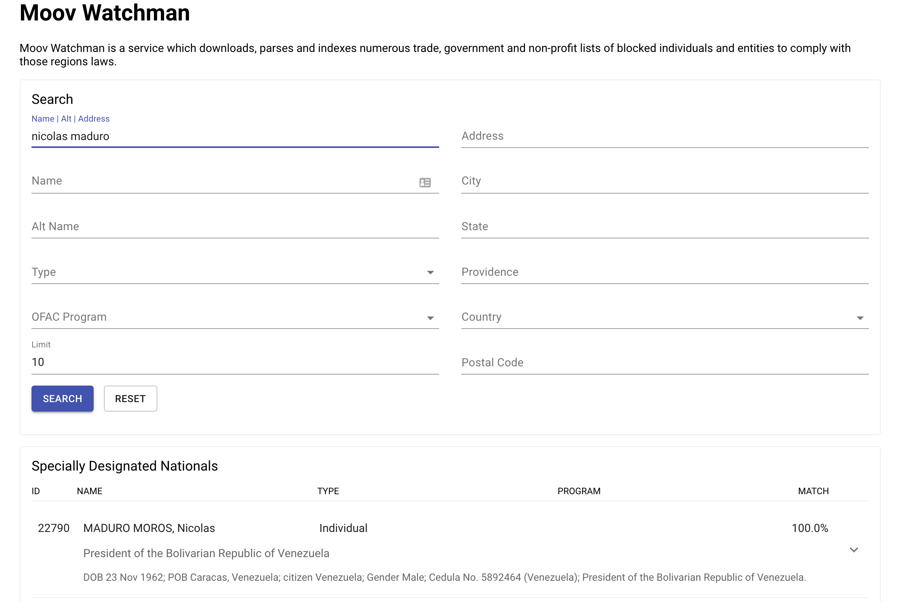
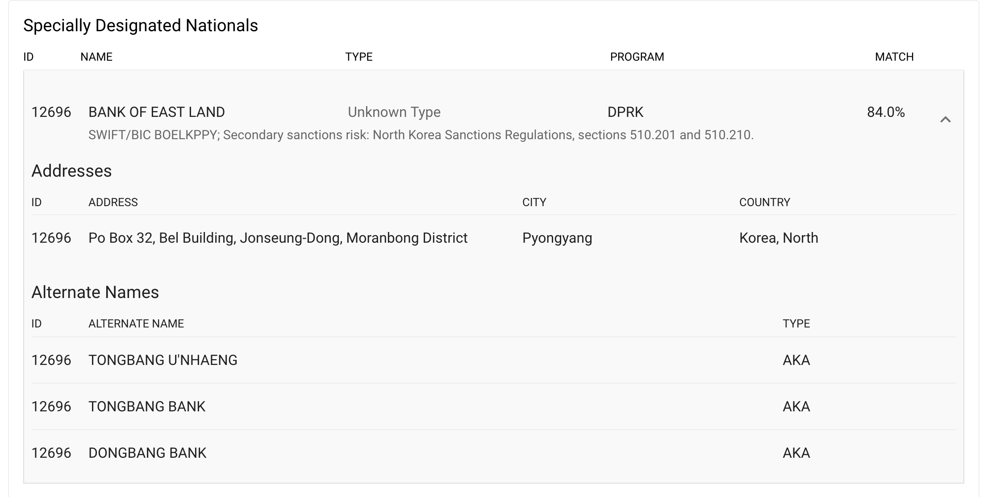

## WebUI

Moov Watchman ships with a web interface which can be used in mobile and desktop browsers. The data is pulled from US government websites and indexed for fuzzy comparisons against names and address metadata.


<em style="font-size:smaller;">Thanks to Linden Lab for the initial contribution of the web interface.</em>

### Searching

Watchman supports [several search operations](./search.md) over the data files and the web interface can be used to search using these. To perform a name search, enter it into the `Name:` field and submit the search.



Results will be returned down below and each SDN can be expanded to show related data (alternate names, addresses, etc).



### UI developers

Watchman has an endpoint for returning an ordered and distinct set of values for various columns of the original data. This is helpful in designing UIs so that dropdowns and more intuitive designs can be created from the Watchman service. Currently, only `sdnType` and `program` are supported, but please [request additional columns to be supported](https://github.com/moov-io/watchman/issues/new?title=values:%20{{column}}%20request).

```
$ curl -s http://localhost:8084/ui/values/sdnType
["aircraft","individual","vessel"]
```
